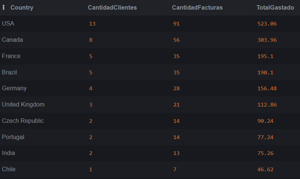
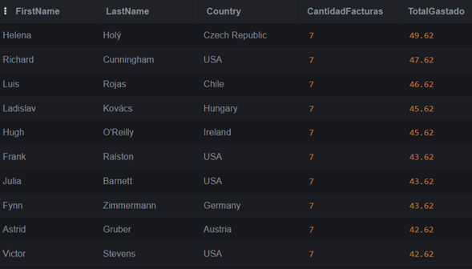
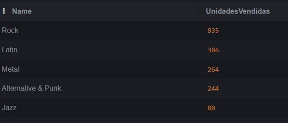
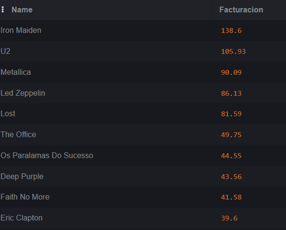

# Análisis de Ventas - Chinook Music Store

Análisis exploratorio de la base de datos pública **Chinook** (tienda de música digital), respondiendo preguntas clave de negocio sobre clientes, catálogo y operación. El objetivo es demostrar dominio de SQL aplicado a análisis de datos.

## Resumen ejecutivo

A partir de cinco análisis sobre la base Chinook (2021–2025), se identifican tres hallazgos clave:

1. **Concentración geográfica**: USA y Canadá concentran cerca del 47% de la facturación del top 10 de países, lo que indica una fuerte dependencia de mercados angloparlantes.
2. **Rock domina el catálogo**: el género Rock supera a Latin (segundo lugar) por más del doble en unidades vendidas, mientras que la presencia de Latin como segundo género sugiere una base relevante de clientes hispanohablantes.
3. **Contenido no musical entre los más vendidos**: entre los 10 artistas con mayor facturación aparecen las series "Lost" y "The Office", lo que indica que la tienda no se limita a música y que el contenido audiovisual genera revenue significativo.

## Contexto del proyecto

Chinook es una base de datos relacional que simula una tienda de música digital tipo iTunes, con información de clientes, facturas, álbumes, artistas, géneros, canciones y empleados de soporte. Para este análisis se asume el rol de analista de datos respondiendo preguntas de la gerencia para soporte a decisiones.

## Herramientas utilizadas

- **SQL (SQLite)**: lenguaje de consulta principal.
- **sqliteonline.com**: entorno de ejecución.
- **Base de datos**: Chinook v1.4.5 ([fuente oficial](https://github.com/lerocha/chinook-database)).

## Habilidades demostradas

- JOINs simples y múltiples (INNER JOIN, LEFT JOIN).
- Agregaciones con GROUP BY (COUNT, SUM, AVG, COUNT DISTINCT).
- Filtros con WHERE y HAVING.
- Funciones de fecha (strftime para series temporales).
- Limpieza de resultados (ROUND para precisión decimal).
- Diseño de consultas legibles y comentadas.

## Preguntas respondidas

### 1. Top 10 países por facturación

Análisis de los mercados más importantes de la tienda, mostrando cantidad de clientes únicos, número de facturas y total facturado por país.

**Hallazgo principal**: USA lidera con 13 clientes, 91 facturas y $523.06 facturados, seguido de Canadá con 8 clientes y $303.96. Estos dos mercados angloparlantes concentran cerca del 47% de la facturación del top 10. Francia y Brasil empatan en número de clientes (5) y facturas (35), con facturación casi idéntica. Esta concentración sugiere oportunidades de expansión en mercados subrepresentados.

### 2. Top 10 clientes por gasto total

Identificación de los clientes más valiosos de la tienda, útil para programas de fidelización.

**Hallazgo principal**: Los 10 clientes top tienen exactamente 7 facturas cada uno, lo que sugiere un comportamiento de compra muy similar entre los clientes recurrentes. Sin embargo, el gasto total varía entre $42.62 y $49.62, una diferencia de $7 que abre la pregunta de qué productos compran los clientes top frente a los demás. USA es el país más representado en este top con 4 clientes (Cunningham, Ralston, Barnett, Stevens), lo que refuerza el hallazgo del análisis 1.

### 3. Top 5 géneros musicales más vendidos

Análisis por unidades vendidas (no por cantidad de canciones en catálogo) para identificar qué géneros mueven el negocio.

**Hallazgo principal**: Rock domina con 835 unidades vendidas, más del doble que Latin (386) en segundo lugar. La presencia de Latin como segundo género más vendido es notable para una tienda global y sugiere una base importante de clientes latinoamericanos, lo cual es coherente con la presencia de Brasil en el top de países. Metal y Alternative & Punk completan el podio con cifras similares entre sí, mientras que Jazz aparece muy por debajo (80 unidades), lo que podría indicar oportunidades de promoción dirigida o reconsideración de catálogo en géneros menos vendidos.

### 4. Top 10 artistas con mayor facturación

Análisis del catálogo desde la perspectiva de revenue por artista, multiplicando precio unitario por cantidad vendida.

**Hallazgo principal**: Iron Maiden lidera con $138.60, seguido por U2 ($105.93), Metallica ($90.09), Led Zeppelin ($86.13) y Lost ($81.59). Después del top 5 la facturación cae aproximadamente un 40% y se mantiene en valores similares entre los puestos 6 al 10. Un dato muy interesante: entre los 10 artistas con mayor facturación aparecen **"Lost" y "The Office"**, que no son artistas musicales sino series de televisión. Esto revela que la tienda no se limita a música y que el contenido audiovisual aporta una porción relevante del revenue, lo cual es información valiosa para decisiones de catálogo y marketing.

### 5. Facturación mensual de la tienda

Serie temporal de ventas mes a mes para detectar tendencias y estacionalidad (período enero 2021 – diciembre 2025).

[Ver tabla completa de facturación mensual](screenshots/05_facturacion_mensual.csv)

**Hallazgo principal**: La facturación mensual se mantiene muy estable en torno a $37.62 a lo largo de los 5 años, con variaciones puntuales tanto al alza como a la baja. El mes con mayor facturación fue enero de 2022 ($52.62) y el de menor facturación fue noviembre de 2023 ($23.76). No se observan picos estacionales claros en fechas comerciales (diciembre, junio), lo que sugiere que el negocio no depende de temporadas específicas sino de una base de clientes con comportamiento de compra recurrente y predecible. Esta estabilidad puede ser una ventaja (ingresos predecibles) pero también un alerta (poca capacidad de generar picos de venta).

## Estructura del repositorio
analisis-ventas-chinook/
├── README.md
├── analisis_ventas_chinook.sql
├── 01_top_paises.png
├── 02_top_clientes.png
├── 03_top_generos.png
├── 04_top_artistas.png
└── 05_facturacion_mensual.csv

## Próximos pasos / mejoras posibles

- **Análisis de retención y churn**: identificar clientes que dejaron de comprar y patrones de abandono.
- **Análisis RFM (Recencia, Frecuencia, Valor monetario)**: segmentación de clientes para campañas dirigidas.
- **Profundización en el contenido no musical**: cuantificar qué porcentaje del revenue proviene de series, podcasts u otros formatos.
- **Visualización en Power BI**: convertir el análisis en un dashboard interactivo para gerencia.
- **Análisis comparativo año contra año** para detectar tendencias no visibles en la serie mensual.

## Cómo reproducir el análisis

1. Descargar el archivo [Chinook_Sqlite.sql](https://github.com/lerocha/chinook-database/raw/master/ChinookDatabase/DataSources/Chinook_Sqlite.sql).
2. Abrir [sqliteonline.com](https://sqliteonline.com) e importar el archivo.
3. Ejecutar las consultas del archivo `analisis_ventas_chinook.sql` en orden.

## Autora

Katherin Liceth Reyes Enciso  
Próxima graduada en Matemáticas — enfocada en análisis y ciencia de datos.  
[LinkedIn](https://www.linkedin.com/in/katherin-liceth-reyes-enciso-911b62186/) · [GitHub](https://github.com/KatherinReyes06)
